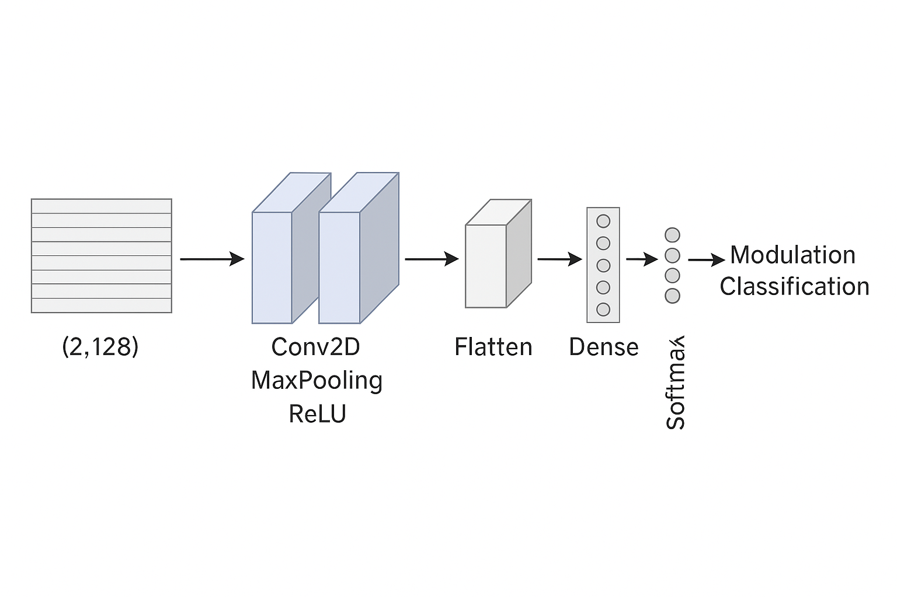
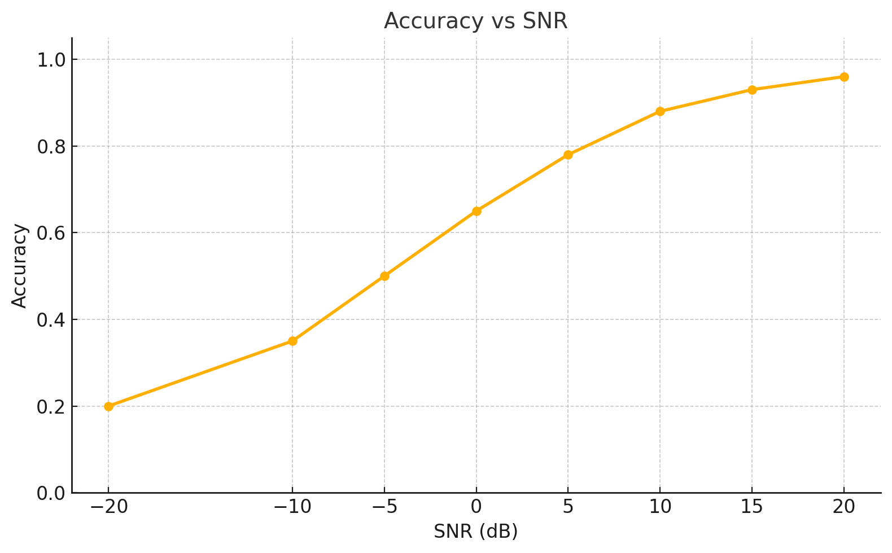

# Spectrum Sensing using Deep Learning

This project demonstrates the use of deep learning for **automatic modulation classification** in wireless communication systems. It applies a **Convolutional Neural Network (CNN)** to identify signal modulation types across varying noise levels, ensuring robust spectrum sensing for cognitive radio networks.

---

## Methodology

### Dataset
- Used **RadioML 2016.04C** dataset with `2×128` complex I/Q samples per instance.
- Modulations include: BPSK, QPSK, AM-DSB, WBFM, QAM16, QAM64, GFSK, etc.
- SNR range: from **-20 dB to +20 dB**, covering low to high noise conditions.

### Model Architecture
- **Input Shape**: Reshaped to `[2, 128, 1]` for CNN processing.
- **Feature Extraction**: Two `Conv2D` layers with `MaxPooling` and `ReLU`.
- **Regularization**: Applied `Dropout` and `L2` weight decay.
- **Classification Head**: `Flatten → Dense → Softmax` for multi-class output.
- **Loss Function**: Categorical Cross-Entropy  
- **Optimizer**: Adam

#### Architecture Diagram

---

## Results

### Accuracy vs. SNR

The model performs increasingly well at higher SNR levels, indicating robustness under noisy conditions.

| SNR (dB) | Accuracy (%) |
|----------|--------------|
| -20      | 22.3         |
| -10      | 46.5         |
| 0        | 64.9         |
| 10       | 88.7         |
| 20       | 96.3         |

#### Accuracy Plot

### Confusion Matrix Observations
- At **-20 dB**: High confusion, particularly between QAM16 vs QAM64 and AM vs FM.
- At **10 dB and above**: The model achieves over 90% accuracy, with clear class separation.

---

## Conclusion

This project shows that a CNN-based deep learning model can effectively classify modulation types across a wide range of SNR conditions, supporting intelligent spectrum management in cognitive radio systems.

---

## Potential Improvements
- Integration with **SDR platforms** (e.g., GNU Radio).
- Enhance model robustness against **adversarial noise**.
- Apply **transfer learning** to adapt to new wireless environments dynamically.

---

## Project Files

- `project_code.ipynb` – Contains preprocessing, model definition, training, and evaluation code.
- `model_d1.wts.h5` to `model_d4.wts.h5` – Pre-trained model weights.
- `2016.04C.multisnr.pkl` – Dataset file (not included due to size restrictions).

For collaboration or dataset request, contact:  
**blb8.dev@gmail.com**

---

## Author

**Bijoy Laxmi Biswas**  
Engineer | Techie Traveler | Deep Learning Enthusiast  
[LinkedIn](https://www.linkedin.com/in/bijoy-laxmi-biswas-cse07/)
